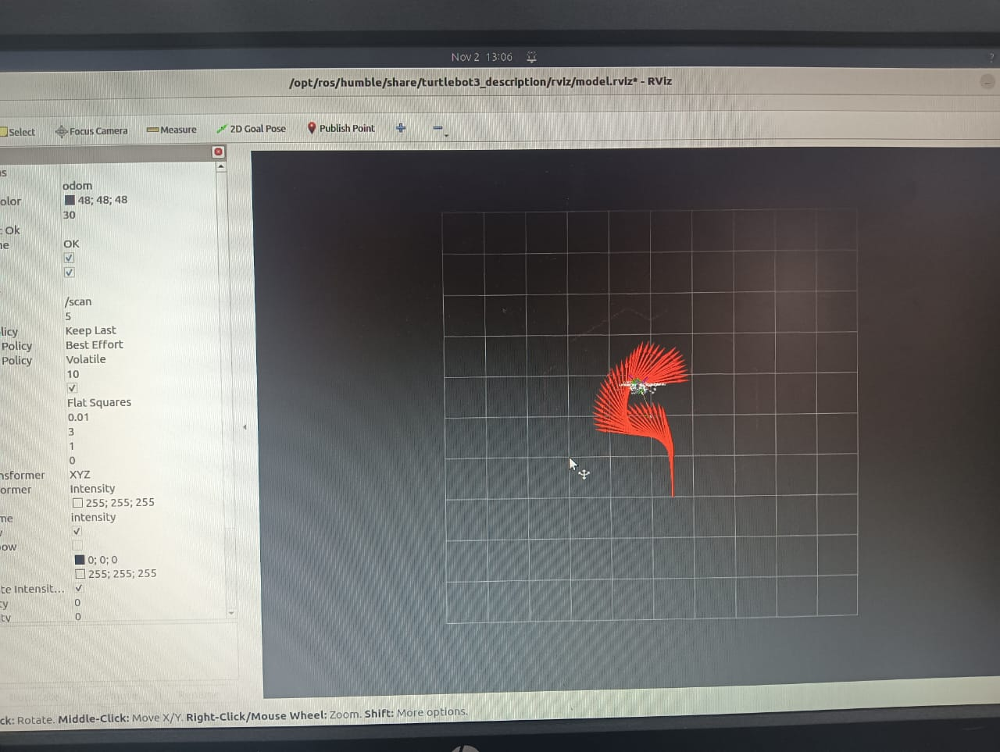

# TurtleBot3 Workspace with Custom DWA Local Planner

A ROS 2 workspace for TurtleBot3 simulation and navigation with a custom Python implementation of the Dynamic Window Approach (DWA) local planner.

## Table of Contents
- [Overview](#overview)
- [Demo](#demo)
- [Features](#features)
- [Prerequisites](#prerequisites)
- [Installation](#installation)
- [Workspace Structure](#workspace-structure)
- [Usage](#usage)
- [Custom DWA Local Planner](#custom-dwa-local-planner)
- [TurtleBot3 Simulations](#turtlebot3-simulations)
- [Contributing](#contributing)
- [License](#license)

## Overview

This workspace contains:
- **Custom DWA Local Planner**: A Python-based implementation of the Dynamic Window Approach algorithm for local path planning
- **TurtleBot3 Simulations**: Official TurtleBot3 simulation packages including Gazebo environments, fake nodes, and manipulation support

## Demo

### Navigation with Custom DWA Planner

<div align="center">

https://github.com/LLawliet2028/turtlebot_ws/assets/demo.mp4

*TurtleBot3 navigating through obstacles using custom DWA local planner*

</div>

> **Note:** If the video doesn't display above, you can view it directly [here](docs/videos/demo.mp4)

### Simulation Environments

<div align="center">
  
  <br />
  <em>RViz Visualization with Laser Scan Data and TurtleBot3</em>
</div>

<br />

> **Note:** More simulation environment screenshots will be added soon.

### Obstacle Avoidance Demo

<div align="center">

> **Video:** [View Obstacle Avoidance Demo](docs/videos/demo.mp4)

*Real-time obstacle avoidance with dynamic obstacles*

</div>

</div>

##  Features

-  Complete TurtleBot3 simulation environment
-  Custom DWA (Dynamic Window Approach) local planner implementation
-  Multiple Gazebo worlds for testing and development
-  TurtleBot3 manipulation support with Gazebo
-  RViz configurations for visualization
-  Flexible and extensible architecture

## Prerequisites

### System Requirements
- **OS**: Ubuntu 22.04 (Jammy) recommended
- **ROS 2**: Humble Hawksbill or later
- **Python**: 3.10+

### Dependencies
```bash
# ROS 2 packages
sudo apt update
sudo apt install ros-humble-desktop
sudo apt install ros-humble-gazebo-ros-pkgs
sudo apt install ros-humble-turtlebot3*
sudo apt install ros-humble-navigation2
sudo apt install ros-humble-nav2-bringup

# Python dependencies
pip3 install numpy
```

### Environment Variables
```bash
# Add to ~/.bashrc
export TURTLEBOT3_MODEL=burger  # or waffle, waffle_pi
source /opt/ros/humble/setup.bash
```

## Installation

1. **Clone the repository**
```bash
git clone https://github.com/LLawliet2028/turtlebot_ws.git
cd turtlebot_ws
```

2. **Install dependencies**
```bash
cd src/turtlebot3_simulations
rosdep install -i --from-path . --rosdistro humble -y
cd ../..
```

3. **Build the workspace**
```bash
colcon build --symlink-install
```

4. **Source the workspace**
```bash
source install/setup.bash
```

## 📁 Workspace Structure

```
turtlebot_ws/
├── src/
│   ├── dwa_algo/                       # Custom DWA implementation
│   │   ├── dwa_algo/
│   │   │   ├── __init__.py
│   │   │   └── dwa_planner.py         # Main DWA algorithm with visualization
│   │   ├── package.xml
│   │   ├── setup.cfg
│   │   └── setup.py
│   │
│   └── turtlebot3_simulations/         # TurtleBot3 simulation packages
│       ├── turtlebot3_fake_node/       # Simulated robot without Gazebo
│       ├── turtlebot3_gazebo/          # Gazebo simulation environments
│       ├── turtlebot3_manipulation_gazebo/  # Manipulation simulations
│       └── turtlebot3_simulations/     # Meta-package
```

## Usage

### Basic Gazebo Simulation

**Launch TurtleBot3 in an empty world:**
```bash
ros2 launch turtlebot3_gazebo empty_world.launch.py
```

**Launch TurtleBot3 in TurtleBot3 World:**
```bash
ros2 launch turtlebot3_gazebo turtlebot3_world.launch.py
```

**Launch TurtleBot3 in House environment:**
```bash
ros2 launch turtlebot3_gazebo turtlebot3_house.launch.py
```

### Teleoperation

**Control the robot with keyboard:**
```bash
ros2 run turtlebot3_teleop teleop_keyboard
```

### Using the Custom DWA Local Planner

**Run the DWA planner node:**
```bash
ros2 run dwa_algo dwa_planner
```

The DWA planner subscribes to:
- `/odom` - Robot odometry (pose and velocity)
- `/scan` - Laser scan data for obstacle detection
- `/goal_pose` - Target goal position
- `/move_base_simple/goal` - RViz 2D Nav Goal support

And publishes to:
- `/cmd_vel` - Velocity commands
- `/dwa_trajectories` - Trajectory visualization for RViz

### Simulation of DWA local planner

**Launch navigation stack with custom DWA planner:**
```bash
# Terminal 1: Launch Gazebo
ros2 launch turtlebot3_gazebo turtlebot3_world.launch.py

# Terminal 2: Launch Dwa custom package
ros2 run dwa_algo dwa_planner

# Terminal 3: Launch RViz
ros2 launch turtlebot3_bringup rviz2.launch.py

```

### Manipulation Simulation

**Launch TurtleBot3 with OpenManipulator:**
```bash
ros2 launch turtlebot3_manipulation_gazebo turtlebot3_manipulation.launch.py
```

## Custom DWA Local Planner

The Dynamic Window Approach (DWA) is a velocity-based local planner that:
- Generates velocity samples within the robot's dynamic constraints
- Evaluates trajectories based on goal direction, obstacle clearance, and velocity
- Selects optimal velocity commands in real-time

### Key Features
- **Python-based implementation** for easy modification and understanding
- **Real-time obstacle avoidance** using laser scan data
- **Smooth trajectory generation** with unicycle model integration
- **Stagnation detection** to prevent the robot from getting stuck
- **RViz visualization** of all evaluated trajectories
- **Goal queue support** for multi-waypoint navigation

### Algorithm Parameters

The planner uses a `DWAConfig` class with the following configurable parameters:

**Velocity Limits:**
- `max_linear_vel`: 0.5 m/s - Maximum forward speed
- `min_linear_vel`: 0.0 m/s - Minimum forward speed
- `max_angular_vel`: 1.5 rad/s - Maximum turning rate
- `min_angular_vel`: -1.5 rad/s - Minimum turning rate

**Acceleration Limits:**
- `max_linear_accel`: 0.5 m/s² - Maximum linear acceleration
- `max_angular_accel`: 1.5 rad/s² - Maximum angular acceleration

**Sampling Resolution:**
- `linear_vel_samples`: 7 - Number of linear velocity samples
- `angular_vel_samples`: 15 - Number of angular velocity samples

**Trajectory Prediction:**
- `prediction_time`: 2.0 seconds - Look-ahead time horizon
- `dt`: 0.1 seconds - Time step for trajectory prediction

**Cost Function Weights:**
- `goal_cost_weight`: 1.0 - Weight for goal direction
- `obstacle_cost_weight`: 3.0 - Weight for obstacle avoidance (highest priority)
- `velocity_cost_weight`: 0.1 - Weight for velocity preference

**Safety Parameters:**
- `robot_radius`: 0.18 m - Robot footprint radius
- `min_obstacle_distance`: 0.25 m - Minimum safe distance from obstacles
- `goal_tolerance`: 0.15 m - Distance to consider goal reached

### ROS 2 Topics

**Subscriptions:**
- `/odom` (nav_msgs/Odometry) - Robot odometry for pose and velocity
- `/scan` (sensor_msgs/LaserScan) - Laser scan data for obstacle detection
- `/goal_pose` (geometry_msgs/PoseStamped) - Target goal position
- `/move_base_simple/goal` (geometry_msgs/PoseStamped) - RViz 2D Nav Goal support

**Publications:**
- `/cmd_vel` (geometry_msgs/Twist) - Velocity commands to robot
- `/dwa_trajectories` (visualization_msgs/MarkerArray) - Trajectory visualization in RViz

### Features Explained

**1. Dynamic Window Generation**
The planner computes a dynamic window of admissible velocities based on:
- Current robot velocity
- Maximum acceleration constraints
- Velocity limits

**2. Trajectory Prediction**
For each velocity pair (linear, angular), the planner:
- Predicts the robot's path over the prediction horizon
- Uses unicycle motion model for accurate trajectory simulation
- Transforms predictions to world frame coordinates

**3. Cost Evaluation**
Each trajectory is evaluated with three cost components:
- **Goal Cost**: Distance from trajectory endpoint to goal
- **Obstacle Cost**: Inverse distance to nearest obstacle (infinity for collisions)
- **Velocity Cost**: Penalty for low speeds and high angular velocities

**4. Stagnation Detection**
The planner monitors if the best cost remains unchanged for 25 consecutive iterations and stops the robot to prevent futile motion.

**5. Trajectory Visualization**
All evaluated trajectories are published to RViz with color coding:
- **Green**: Selected best trajectory
- **Red**: Collision trajectories (infinite cost)
- **Purple-Blue gradient**: Valid trajectories (darker = better cost)

### Customization Example
```python
# Modify parameters in dwa_planner.py (DWAConfig class)
class DWAConfig:
    def __init__(self):
        self.max_linear_vel = 0.7  # Increase max speed
        self.obstacle_cost_weight = 5.0  # More conservative obstacle avoidance
        self.goal_cost_weight = 2.0  # Stronger goal attraction
        self.prediction_time = 3.0  # Longer look-ahead
```

### Running the DWA Planner

**Launch the planner node:**
```bash
ros2 run dwa_algo dwa_planner
```

**Send a goal (command line):**
```bash
ros2 topic pub /goal_pose geometry_msgs/msg/PoseStamped "{
  header: {frame_id: 'map'},
  pose: {
    position: {x: 2.0, y: 1.0, z: 0.0},
    orientation: {x: 0.0, y: 0.0, z: 0.0, w: 1.0}
  }
}"
```

**Or use RViz 2D Nav Goal tool:**
1. Launch RViz: `ros2 launch nav2_bringup rviz_launch.py`
2. Click "2D Nav Goal" button
3. Click and drag on the map to set goal position and orientation

**Visualize trajectories in RViz:**
1. Add MarkerArray display
2. Set topic to `/dwa_trajectories`
3. Observe real-time trajectory evaluation

## Available Gazebo Worlds

1. **Empty World** - Basic testing environment
2. **TurtleBot3 World** - Obstacles and structures
3. **TurtleBot3 House** - Indoor home environment
4. **Custom Worlds** - Located in `turtlebot3_gazebo/worlds/`

## Configuration

### Robot Model Selection
```bash
export TURTLEBOT3_MODEL=burger  # Options: burger, waffle, waffle_pi
```

### RViz Configuration
RViz configuration files are available in:
- `turtlebot3_gazebo/rviz/`
- `turtlebot3_manipulation_gazebo/rviz/`

## Troubleshooting

### Gazebo Models Not Found
```bash
# Set Gazebo model path
export GAZEBO_MODEL_PATH=$GAZEBO_MODEL_PATH:~/turtlebot_ws/src/turtlebot3_simulations/turtlebot3_gazebo/models
```

### DWA Planner Issues
- Ensure odometry and laser scan topics are publishing
- Check parameter tuning in `dwa_planner.py`
- Verify coordinate frame transformations

### Build Errors
```bash
# Clean build
rm -rf build install log
colcon build --symlink-install
```

## Resources

- [TurtleBot3 Official Documentation](https://emanual.robotis.com/docs/en/platform/turtlebot3/overview/)
- [ROS 2 Navigation2 Documentation](https://navigation.ros.org/)
- [DWA Algorithm Paper](https://ieeexplore.ieee.org/document/580977)
- [Gazebo Tutorials](https://gazebosim.org/docs)

## Contributing

Contributions are welcome! Please see [CONTRIBUTING.md](src/turtlebot3_simulations/CONTRIBUTING.md) for guidelines.

### Development Workflow
1. Fork the repository
2. Create a feature branch (`git checkout -b feature/amazing-feature`)
3. Commit your changes (`git commit -m 'Add amazing feature'`)
4. Push to the branch (`git push origin feature/amazing-feature`)
5. Open a Pull Request

## License

This project includes:
- Custom DWA Local Planner: [Specify your license]
- TurtleBot3 Simulations: Apache License 2.0 (see [LICENSE](src/turtlebot3_simulations/LICENSE))

## Author

**LLawliet2028**
- GitHub: [@LLawliet2028](https://github.com/LLawliet2028)

## Acknowledgments

- ROBOTIS for TurtleBot3 platform and simulation packages
- ROS 2 and Navigation2 communities
- DWA algorithm original authors

## Citation

If you use this workspace in your research, please cite:
```bibtex
@software{turtlebot_ws_2024,
  author = {LLawliet2028},
  title = {TurtleBot3 Workspace with Custom DWA Local Planner},
  year = {2024},
  url = {https://github.com/LLawliet2028/turtlebot_ws}
}
```


For questions or issues, please open an issue on GitHub.
